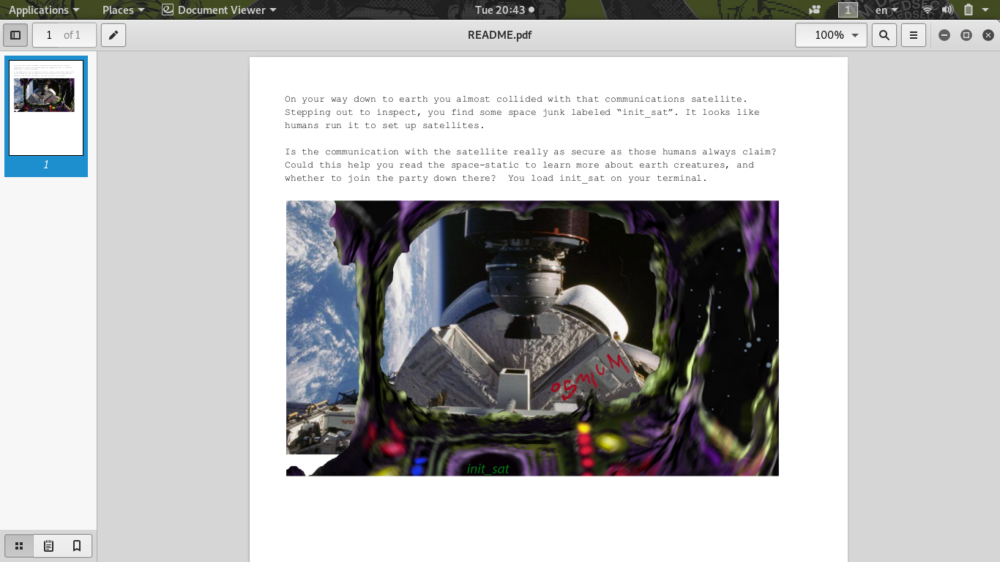

# Satellite
```
Description:

Placing your ship in range of the Osmiums, you begin to receive signals. Hoping that you are not detected, because it's too late now, you figure that it may be worth finding out what these signals mean and what information might be "borrowed" from them. Can you hear me Captain Tim? Floating in your tin can there? Your tin can has a wire to ground control?

Find something to do that isn't staring at the Blue Planet.
```
[file.zip](file.zip)

Inside the zip got 2 files: `init_sat` and `README.pdf`

First, I open up the pdf file given:


Running `file` command to inspect what type of file it is:
```
# file init_sat 
init_sat: ELF 64-bit LSB executable, x86-64, version 1 (SYSV), dynamically linked, interpreter /lib64/ld-linux-x86-64.so.2, Go BuildID=YhfyV09rKV_0ewkLiNr1/6ZJO5J8awFQSRgZDzlnA/zvyuoO7Qu3ralSU_Aheb/QK0rATh0jzljJY8j2313, not stripped
```
It is executable file, lets `chmod +x` and run it!
```
./init_sat 
Hello Operator. Ready to connect to a satellite?
Enter the name of the satellite to connect to or 'exit' to quit

```
We need the satellite name to continue

After some guessing, we saw a **red handwritting** on the pdf file: `osmium` and it is the name!

```
Hello Operator. Ready to connect to a satellite?
Enter the name of the satellite to connect to or 'exit' to quit
osmium
Establishing secure connection to osmium
 satellite...
Welcome. Enter (a) to display config data, (b) to erase all data or (c) to disconnect

a
Username: brewtoot password: ********************	166.00 IS-19 2019/05/09 00:00:00	Swath 640km	Revisit capacity twice daily, anywhere Resolution panchromatic: 30cm multispectral: 1.2m	Daily acquisition capacity: 220,000km²	Remaining config data written to: https://docs.google.com/document/d/14eYPluD_pi3824GAFanS29tWdTcKxP_XUxx7e303-3E

```

After this, we quickly go to the link above `https://docs.google.com/document/d/14eYPluD_pi3824GAFanS29tWdTcKxP_XUxx7e303-3E`

And it is just a base64 string:
 `VXNlcm5hbWU6IHdpcmVzaGFyay1yb2NrcwpQYXNzd29yZDogc3RhcnQtc25pZmZpbmchCg==`

Decoding the string become:
```python
>>> 'VXNlcm5hbWU6IHdpcmVzaGFyay1yb2NrcwpQYXNzd29yZDogc3RhcnQtc25pZmZpbmchCg=='.decode('base64')
'Username: wireshark-rocks\nPassword: start-sniffing!\n'
```
*Before it is not wireshark-rocks, someone had change the username and password*

Then I run `strings` and `ltrace` but found nothing

Finally, I run `strace ./init_sat` found something interesting:

```
read(3, "Username: brewtoot password: CTF"..., 4096) = 363
write(1, "Username: brewtoot password: ***"..., 339Username: brewtoot password: ********************	166.00 IS-19 2019/05/09 00:00:00	Swath 640km	Revisit capacity twice daily, anywhere Resolution panchromatic: 30cm multispectral: 1.2m	Daily acquisition capacity: 220,000km²	Remaining config data written to: https://docs.google.com/document/d/14eYPluD_pi3824GAFanS29tWdTcKxP_XUxx7e303-3E
```
It reads `password: CTF...` but writes `password: ********************`

The `CTF...` must be the flag!

Running `strace -h` found that using `-s` can control the limit length of print strings

So running `strace -s 100 ./init_sat` will reveal the flag:
```
read(3, "Username: brewtoot password: CTF{4efcc72090af28fd33a2118985541f92e793477f}\t166.00 IS-19 2019/05/09 0"..., 4096) = 363
write(1, "Username: brewtoot password: ********************\t166.00 IS-19 2019/05/09 00:00:00\tSwath 640km\tRevis"..., 339Username: brewtoot password: ********************	166.00 IS-19 2019/05/09 00:00:00	Swath 640km	Revisit capacity twice daily, anywhere Resolution panchromatic: 30cm multispectral: 1.2m	Daily acquisition capacity: 220,000km²	Remaining config data written to: https://docs.google.com/document/d/14eYPluD_pi3824GAFanS29tWdTcKxP_XUxx7e303-3E
```

# Flag
> CTF{4efcc72090af28fd33a2118985541f92e793477f}